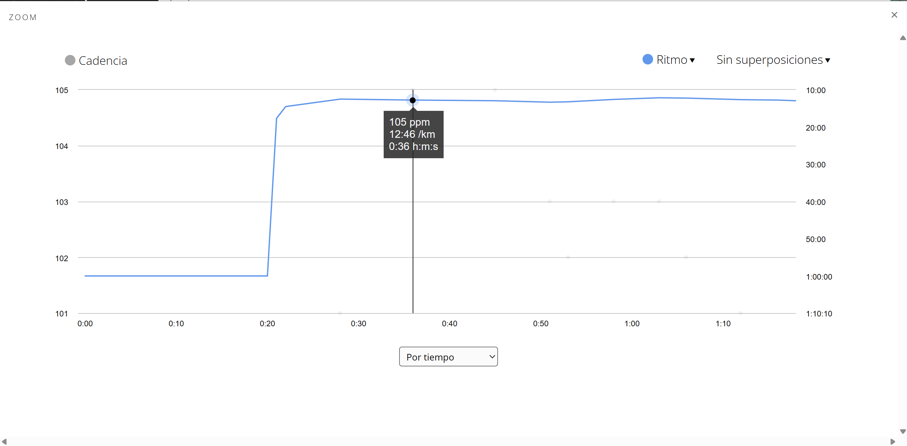
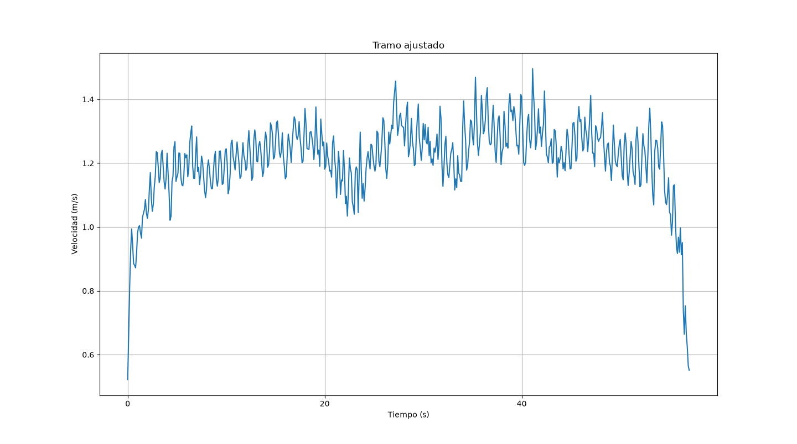
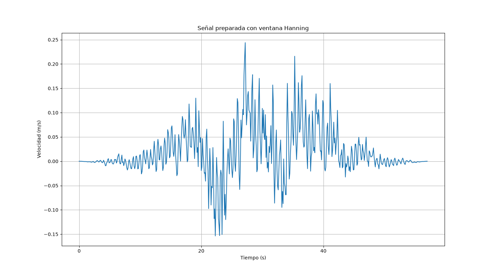
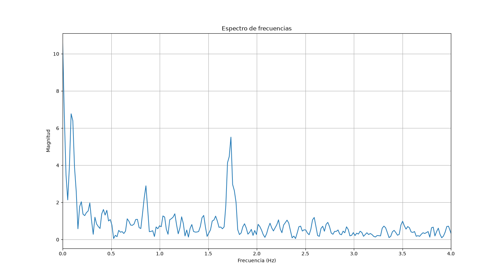
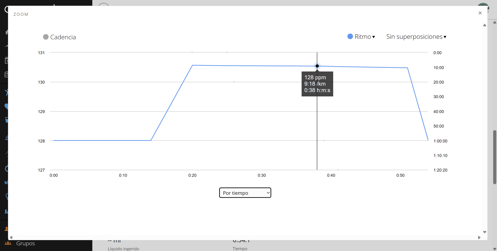
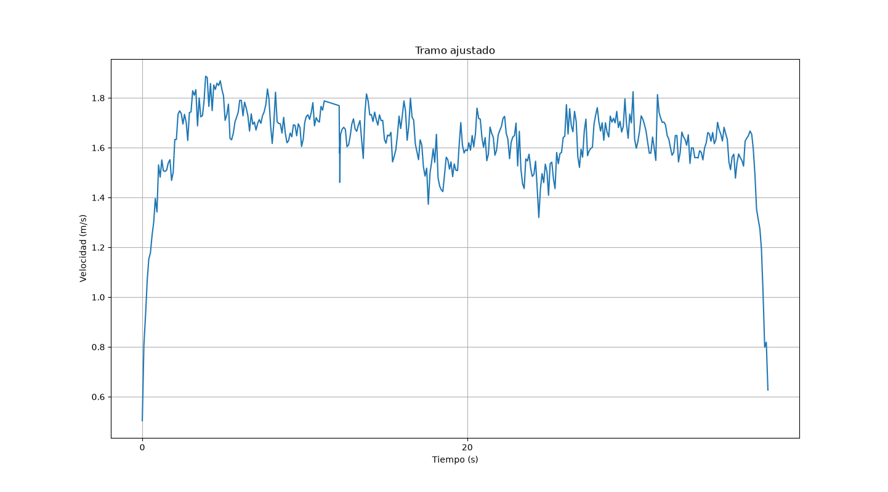
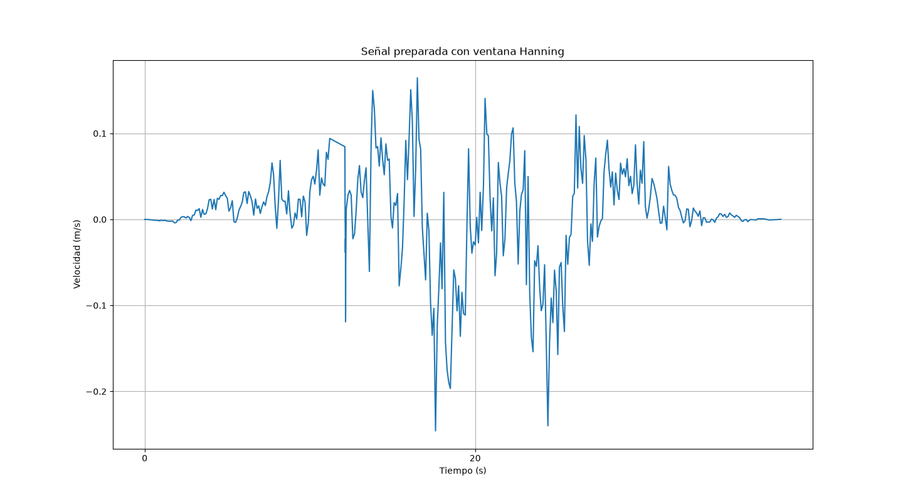
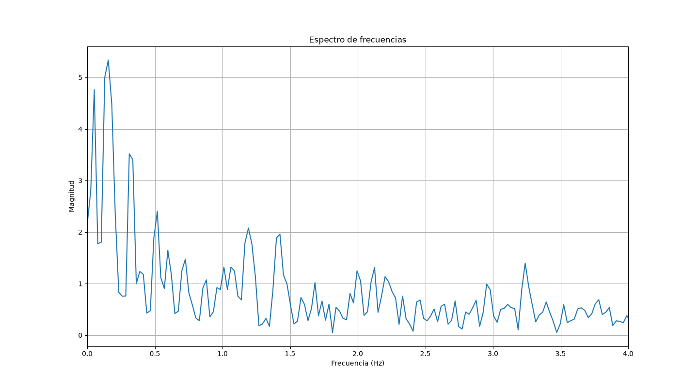

# Validación inicial con Garmin

Esta validación forma parte del proyecto `laboratorio-fourier-gps`.

El objetivo de esta prueba es comparar la cadencia estimada mediante análisis de Fourier sobre la velocidad GPS con los datos registrados por un reloj Garmin durante dos pruebas caminando.

La versión actual del programa calcula una frecuencia dominante global del tramo analizado. A partir de esa frecuencia se obtiene:

- cadencia estimada en pasos/min;
- número aproximado de pasos del tramo.

La cadena de análisis utilizada es:

CSV GPS → velocidad GPS → selección de tramo → quitar media → quitar tendencia lenta → ventana Hanning → frecuencia de muestreo → FFT → frecuencia dominante → cadencia → pasos estimados.

## Aclaración importante

El análisis actual es global. Esto significa que obtiene una cadencia dominante del tramo completo, no una cadencia instantánea segundo a segundo.

Además, el método asume que la frecuencia dominante de la velocidad GPS corresponde a la frecuencia de los pasos. Esta hipótesis puede funcionar bien cuando las oscilaciones principales de la velocidad están producidas claramente por los pasos, pero puede fallar si aparecen otras variaciones de la señal con más peso que la propia cadencia.

---

# Prueba 1 - Caminata normal

## Datos de Garmin

| Métrica | Valor |
|---|---:|
| Distancia | 0.07 km |
| Tiempo total | 1:17.8 |
| Tiempo en movimiento | 0:58 |
| Cadencia media total | 60 pasos/min |
| Cadencia máxima | 107 pasos/min |
| Pasos | 96 |
| Ritmo medio | 17:34 /km |
| Ritmo medio en movimiento | 13:06 /km |

La cadencia media total de Garmin no es representativa para comparar con el algoritmo, porque la actividad incluye un periodo inicial en parado.

Por eso, para la comparación se usa la zona en movimiento. En la gráfica de Garmin, durante la fase de marcha, la cadencia se mantiene aproximadamente alrededor de 104-105 pasos/min.

## Datos del algoritmo Fourier GPS

Archivo analizado:

`DATA0002.CSV`

Tramo introducido manualmente:

- inicio: 196 s
- fin: 273 s

El programa ajustó automáticamente el tramo de movimiento mediante el umbral de velocidad.

| Métrica | Valor |
|---|---:|
| Duración del tramo ajustado | 57.005 s |
| Frecuencia de muestreo | 10 Hz |
| Frecuencia dominante | 1.7338 Hz |
| Cadencia estimada | 104.03 pasos/min |
| Pasos estimados | 98.84 |

## Comparación

| Métrica | Garmin | Fourier GPS |
|---|---:|---:|
| Tiempo en movimiento | 58 s | 57.005 s |
| Cadencia durante el movimiento | ~104-105 pasos/min | 104.03 pasos/min |
| Pasos | 96 | 98.84 |

La diferencia entre los pasos estimados por Fourier y los pasos registrados por Garmin es:

98.84 - 96 = 2.84 pasos

Esto supone un error aproximado del 3 % respecto a Garmin.

## Resultado de la prueba 1

En esta prueba, el algoritmo estima muy bien la cadencia durante la fase de movimiento.

La señal preparada con ventana Hanning muestra oscilaciones periódicas bastante claras y regulares. Esas oscilaciones son compatibles con la cadencia de los pasos, por lo que la FFT detecta correctamente una frecuencia dominante alrededor de 1.73 Hz.

Al convertir esa frecuencia a pasos/min, el resultado coincide muy bien con la cadencia observada en Garmin.

---

# Prueba 2 - Caminata rápida

## Datos de Garmin

| Métrica | Valor |
|---|---:|
| Distancia | 0.07 km |
| Tiempo total | 0:54.1 |
| Tiempo en movimiento | 0:37 |
| Cadencia máxima | 133 pasos/min |
| Pasos | 78 |
| Ritmo medio en movimiento | 8:59 /km |

En la gráfica de Garmin, la cadencia durante la fase de movimiento se sitúa aproximadamente entre 128 y 131 pasos/min.

A partir de los pasos y el tiempo en movimiento:

78 pasos / 37 s × 60 = 126.5 pasos/min

Por tanto, la cadencia esperada para esta prueba está aproximadamente en torno a 126-131 pasos/min.

## Datos del algoritmo Fourier GPS

Archivo analizado:

`DATA0002.CSV`

Tramo introducido manualmente:

- inicio: 300 s
- fin: 355 s

El programa ajustó automáticamente el tramo de movimiento mediante el umbral de velocidad.

| Métrica | Valor |
|---|---:|
| Duración del tramo ajustado | 38.501 s |
| Frecuencia de muestreo | 10 Hz |
| Frecuencia dominante seleccionada | 1.1917 Hz |
| Cadencia estimada | 71.50 pasos/min |
| Pasos estimados | 45.88 |

## Comparación

| Métrica | Garmin | Fourier GPS |
|---|---:|---:|
| Tiempo en movimiento | 37 s | 38.501 s |
| Cadencia durante el movimiento | ~126-131 pasos/min | 71.50 pasos/min |
| Pasos | 78 | 45.88 |

En esta prueba, el resultado automático del algoritmo no coincide con Garmin.

Garmin muestra una cadencia aproximada de 126-131 pasos/min, pero el algoritmo selecciona una frecuencia de 1.1917 Hz, equivalente a 71.50 pasos/min.

La frecuencia esperada según Garmin sería aproximadamente:

126.5 / 60 = 2.11 Hz

Por tanto, la frecuencia seleccionada automáticamente por el algoritmo no representa la cadencia real de pasos en esta prueba.

## Resultado de la prueba 2

En esta segunda prueba, el método falla al seleccionar la frecuencia dominante.

La señal preparada con ventana Hanning no muestra una oscilación de pasos tan clara como en la primera prueba. En lugar de una repetición regular, aparecen variaciones más irregulares y componentes de mayor amplitud que no parecen corresponder únicamente a los pasos.

Esto provoca que la FFT encuentre un pico dominante que no representa la cadencia real, sino otra variación presente en la velocidad GPS.

---

# Conclusión de la validación

La validación con Garmin muestra dos comportamientos distintos.

En la primera prueba, la señal GPS contiene oscilaciones periódicas claras asociadas a los pasos. En ese caso, el análisis de Fourier funciona bien: la frecuencia dominante detectada coincide con la cadencia mostrada por Garmin y el número de pasos estimado se aproxima mucho al valor registrado por el reloj.

En la segunda prueba, la señal GPS contiene variaciones más irregulares y componentes que no parecen corresponder únicamente a la cadencia. Aunque la persona caminaba a un ritmo aparentemente constante, la velocidad medida por el GPS no refleja los pasos de forma tan limpia. Como consecuencia, el algoritmo selecciona una frecuencia dominante incorrecta.

La conclusión principal es que el método no depende solo de aplicar Fourier, sino de que la señal de velocidad GPS contenga de forma suficientemente clara la periodicidad de los pasos.

Por tanto, la versión actual funciona cuando la frecuencia asociada a los pasos es el componente dominante de la señal dentro del rango analizado. Si otras variaciones de la velocidad tienen más peso que la propia cadencia, el algoritmo puede seleccionar un pico incorrecto.
